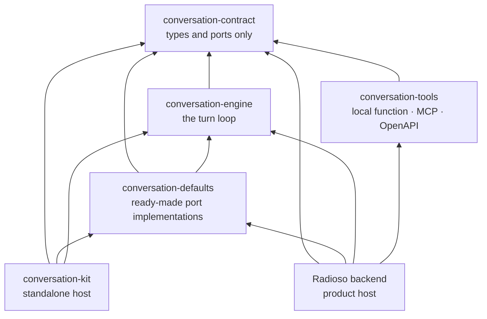

import { Callout } from 'nextra/components'

# Conversation engine

Every turn — dashboard chat, a public link, the embed widget, the API, an MCP client — runs through one loop. That loop lives in its own packages rather than inside the backend, which is what lets the same conversation behavior run in more than one host.

The loop is deliberately ignorant. It holds the *mechanism* of a turn: steer with directives, pick a skill, advance a routine, compose a reply. Everything concrete — the database, the model provider, the HTTP layer — arrives as a port the host passes in.

## The layers

Arrows point from a package to what it depends on. Everything fans in to `conversation-contract`, which depends on nothing at all.

## What each package owns

| Package | Owns | Knows about |
|---|---|---|
| `conversation-contract` | The vocabulary: port interfaces, domain shapes, and the `ConversationEngine` interface. Types only. | Nothing. It has no dependencies. |
| `conversation-engine` | The turn loop that implements the contract, plus routine running, steering resolution, and clarification decisions. | The contract, and nothing else. |
| `conversation-defaults` | Generic implementations of the contract's ports — in-memory stores, a probabilistic directive matcher, routine selection and rendering, the default prompts. | The contract and the engine. |
| `conversation-tools` | Adapters that turn external tools into contract-shaped skills: local functions, MCP servers, OpenAPI services. | The contract. |
| `conversation-kit` | A composition root that wires the above into a runnable conversation, with an SDK client and an HTTP host. | The contract, engine, and defaults. |

The division of labor across the first three is worth stating plainly: **the contract declares, defaults implements generically, and the host implements product-specifically.**

## What a host provides

The engine constructs no adapters. Each turn arrives as a `ProcessTurnInput` carrying everything it needs.

Required on every turn:

- **`ConversationModelGateway`** — a single `complete()` method. This is the one hard requirement.
- **`ConversationStores`** — `loadHistory` and `appendEvent`.
- **`ConversationSkillDispatcher`**, **`ConversationSkillSelector`**, **`ConversationDirectiveMatcher`**, and **`ConversationTurnComposer`**.

Beyond those, the capability ports are optional, and this is the main lever you have over behavior: `SteeringResolver`, `ConversationTurnInterpreter`, `ConversationRetrievalWorkPort`, `ConversationSkillInputResolver`, the routine family (`ConversationRoutineStore`, `Runner`, `Activator`, `ReentryGate`, `SlotCorrection`), `ConversationClarifier`, and `ConversationClarificationStore`.

<Callout type="info" emoji="i">
  Leaving a capability port out switches that capability off for the turn. A host with no `ConversationClarifier` runs conversations that never ask a clarifying question, and the loop itself stays the same.
</Callout>

`conversation-defaults` ships a usable implementation for most of these, so a host supplies a model gateway and overrides only what it wants to own.

## Two hosts

The packages support two independent assemblies, and neither is built on the other.

**The Radioso backend** is the product host. It calls `createConversationEngine()` in `backend/src/app/server/builders/chat.ts` and assembles the concrete collaborators around it — Postgres-backed clarification, routine, and directive state, an LLM turn router and interpreter, conversation summaries, and the agent skill provider. The per-turn seam is `createChatProcessTurnInput` in `backend/src/modules/chat/services/conversationProcessTurnInput.ts`.

**`conversation-kit`** is a second host in the same repo. Its `createConversationKit()` defaults every port — in-memory stores, model-backed matching and selection, a routine runner rebuilt per turn — so a model gateway is the only thing it needs from you. It also ships an HTTP server entry point and a portable authoring store.

Because the engine only ever sees ports, the same directives and routines behave the same way in both.

## Authoring packages

Routines are authored as data, and three packages carry that data rather than the runtime loop.

| Package | Owns |
|---|---|
| `routine-definition` | Zod schemas and types for an authored routine — step kinds, guard kinds, and the shape limits. |
| `routine-markdown` | The portable routine markdown grammar: `parse`, `serialize`, `canonicalize`, and the chip-document conversions the editor uses. |
| `skill-contract` | The product skill catalog shape — display name, owner, execution class, supported callers, required capabilities. |

Authoring and runtime stay separate on purpose. `routine-definition` describes a routine as an operator wrote it; the contract's `Routine` is the compiled graph the engine walks. The backend compiles one into the other in `backend/src/app/composition/routineDefinitionSource.ts`.

<Callout type="warning" emoji="!">
  Two different types are called `SkillDefinition`. The one in `conversation-contract` is a small structural shape the engine understands — name, description, input and output schemas. The one in `skill-contract` is the richer product catalog record. The backend bridges between them; treat them as distinct.
</Callout>

## The boundaries are checked, not just documented

The dependency directions above hold because builds fail when they drift.

- `scripts/validate-architecture-boundaries.mjs` rejects any `@radioso/*` import inside `conversation-contract`, and allows `conversation-engine` exactly one import specifier — the contract. It runs in the backend unit test job.
- `backend/dependency-cruiser.config.cjs` carries a rule named `engine-concretes-only-via-composition`: backend code may import the concrete engine, defaults, and tools packages only from composition and a short list of sanctioned adapter barrels. Everywhere else in the backend depends on the contract.
- `conversation-kit` holds each of its entry points to a declared import budget in `packages/conversation-kit/tests/entryPoints.test.ts`. The budget keeps the root entry runnable anywhere JavaScript runs — a Worker, Deno Deploy, or a browser — while the Node-specific pieces sit behind the `/server` and `/node` entry points.

These are workspace packages under `packages/`, versioned with the repo and built alongside it. They are not published to npm; the released client library is the [TypeScript SDK](/sdk/typescript-getting-started).

## Read next

- [Architecture overview](/architecture)
- [Retrieval pipeline](/architecture/retrieval-pipeline)
- [Authoring routines](/guides/authoring-routines)
