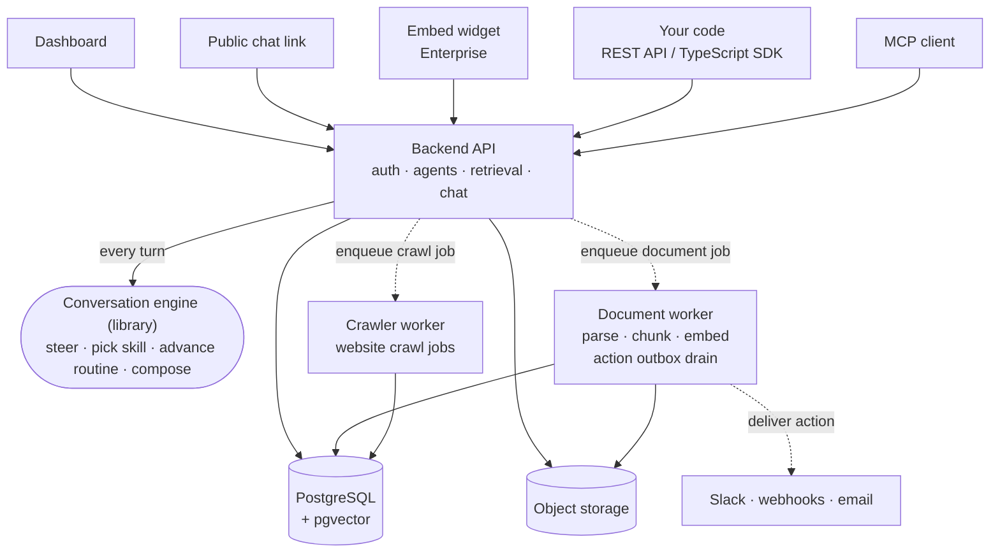

# Architecture overview

Radioso answers questions from the documents a workspace uploads or crawls, so an answer traces back to content you control.

Two clocks run underneath that. A chat turn has to return inside the request that asked for it. Turning a new document into searchable, cited context takes as long as it takes. Radioso keeps those on separate paths, and that split explains most of what follows — why services scale independently, and where to look first when something is wrong.

## The pieces

Solid arrows happen inside the request that triggered them. Dotted arrows hand work off to run on its own clock.

## What each piece owns

| Piece | Owns |
|---|---|
| **Backend API** (Express) | Auth, agent configuration, retrieval, and the assistant chat endpoints every surface sends turns to. |
| **[Conversation engine](/architecture/conversation-engine)** | One turn loop, shared by every surface: steer with directives, pick a skill, advance a routine, compose the reply. It lives in its own packages and reaches the database and the model only through ports the backend hands it. |
| **PostgreSQL + pgvector** | The system of record: accounts, workspace and agent settings, documents, chunks, embeddings, and conversation history. |
| **Document worker** | Parsing, chunking, and embedding, off the request path. The same process drains the action outbox. |
| **Crawler worker** | The website-crawl job lifecycle: claiming crawl jobs and running the crawl provider. |
| **Frontend** (Next.js) | The operator dashboard — agents, retrieval settings, channels — and signed-in chat. |
| **Object storage** | Uploaded source files. The local filesystem in development, GCS in cloud deployments, selected by `DOCUMENT_STORAGE_DRIVER`. |

Backend, frontend, document worker, and crawler worker each deploy as their own service, so you can scale and restart them independently. The conversation engine is the exception: it is a library the backend runs in-process, which is why it has no arrow to the database of its own.

## Ways in

Every surface below talks to the same agent through the same backend, so an answer is consistent wherever it is asked for.

- **Dashboard** — operators configure agents and chat with them while signed in.
- **Public chat link** — anonymous access to a single agent.
- **Website embed widget** — an agent embedded in your own site, in Enterprise Edition.
- **REST API and TypeScript SDK** — your own code, calling the assistant chat and retrieval endpoints directly.
- **MCP client** — Claude, Cursor, and other MCP clients, reaching Radioso over the same versioned HTTP API.

## Two clocks

### Live chat stays immediate

Normal agent chat runs in the live request path — authenticated turns, anonymous turns, Enterprise embedded widget turns, and the bootstrap greeting for a new conversation. Each one ends in an immediate response, immediate streaming, or an explicit failure. Radioso keeps chat in the request path even under load, so a slow reply is visible rather than silently deferred.

### Post-turn side effects run through an action outbox

A turn or routine step can trigger work that does not need to block the reply: notifying an operator about a handoff or approval gate, sending a contact request, posting to Slack, or calling an outbound webhook.

Radioso queues that work as an action request. The document worker process claims it with a lease, delivers it, and retries on failure, so a slow notification target cannot stall the chat turn that triggered it.

### Where to look first

The two clocks are also the first split during an incident. Stuck uploads and a slow chat turn point at different services, so check which clock is affected before digging further.

## Read next

- [Conversation engine](/architecture/conversation-engine)
- [Retrieval pipeline](/architecture/retrieval-pipeline)
- [Document processing lifecycle](/architecture/document-processing-lifecycle)
- [Deployment topology](/architecture/deployment-topology)
