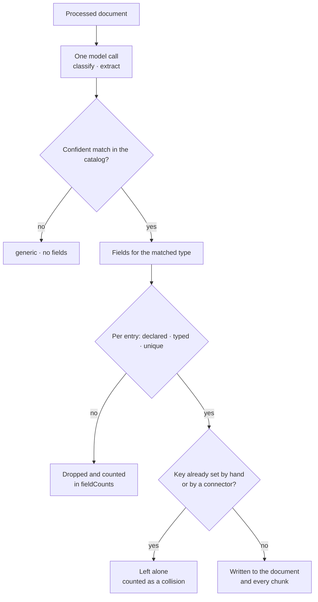

import { Callout, Steps } from 'nextra/components'

# Extract document metadata

Retrieval finds passages that read like the question. That is the right default, and it runs out of road the moment a question has a hard edge in it: only products under 50, only courses starting after September, prefer this season's events over last season's. Those are comparisons, and a comparison needs a typed value sitting on the document — not a sentence that happens to mention a price.

You can type those values by hand, and for twenty documents you probably should. Past that, a **document type** is the better trade: describe a shape of page once — what it looks like, which fields to pull out of it — and every document that matches gets those fields filled in during processing. One model call per document, after the document is already searchable.

This guide walks the whole path with one running example: a workspace full of product pages that wants `price` and `category` it can actually filter on.

## Where the pieces live

| What | Where |
|---|---|
| The document type catalog | **Knowledge → Ingestion → Document types** |
| The workspace extraction toggle | **Knowledge → Ingestion → Metadata extraction** |
| Per-source override and document tags | **Knowledge → Sources**, expand a source, **Settings** |
| Results and provenance for one document | The document's **Properties** panel |
| Rules that use the fields | An agent's **Behavior → Skills → Knowledge Retrieval → Advanced** |

## Define a type

The catalog is workspace-level: one list, shared by every agent and every source.

Five types ship with it. `Event` and `Article` carry the date tags `dateFrom` and `dateTo`. `Profile` and `Reference` classify a document without extracting anything from it. `Generic` catches everything that matches nothing else, which is why it is the one entry you cannot turn off. All five are read-only — you can switch `Event`, `Article`, `Profile`, and `Reference` off when a type only produces noise for your content.

Your own types go underneath. Here is the product example, filled in as the editor asks for it:

<Steps>
### Add the type

**Add document type**, then a label (`Product`) and a key (`product`). The key is the identifier extraction returns and the catalog stores; the label is what you read in the dashboard.

### Describe what such a page looks like

The description is the whole classification signal, so it is worth a real sentence:

> A product detail page: one purchasable item, with a price and availability.

Write it as prose, not as a keyword list. Prose describes a shape, which is what the model matches a document against, and it holds up whatever language your documents are written in. A keyword list narrows the description to the words you happened to think of. Up to 500 characters.

### Add the fields

**Add field**, then a key, a label, a value type, and an instruction per field. For products:

| Key | Label | Value type | Instruction |
|---|---|---|---|
| `price` | Price | number | The listed price as a number, without a currency symbol. |
| `category` | Category | string | The product category this item is sold under. |
| `inStock` | In stock | boolean | Whether the page says the item is currently available. |
| `availableFrom` | Available from | date | The first day the item can be ordered. |

Instructions are one concrete sentence each, up to 240 characters. Say what to pull *and in what form*, because a value that cannot be read as its declared type is dropped. A page showing `€49.90` has to yield `49.9` for a `number` field to survive validation, and "the listed price as a number, without a currency symbol" is what asks for that. Dates work the same way: extraction accepts `date` values as `YYYY-MM-DD`.

### Save

**Save document types**. The save applies to processing that happens from that point on; to apply it to documents you already have, reprocess them (below).
</Steps>

A catalog holds up to 20 of your own types with up to 10 fields each. Keys start with a letter and contain letters, digits, and underscores, up to 64 characters. `dateFrom` and `dateTo` are reserved by the built-in types, and dots are rejected because retrieval rules read `.` as a path separator while extracted tags are written flat. Type descriptions and field instructions also share one budget across the whole catalog: 12,000 rendered characters. A save that exceeds it is rejected and names the number, so trimming a few long descriptions clears it.

## Turn extraction on where it pays

The catalog says what extraction looks for. A separate control says whether it runs, and it resolves from the narrowest choice outward: a single run's override wins, then the source, then the workspace default.

- **Workspace** — **Knowledge → Ingestion → Metadata extraction**. Disabled by default. This is the fallback every source inherits.
- **Source** — **Knowledge → Sources**, expand a source, **Settings**. Three choices: *Use workspace setting*, *Always on for this source*, *Always off for this source*. Turning it on for the product-catalog crawl and leaving it off for the blog is the usual shape.
- **Manually added documents** — documents added by hand have no source record, so they are grouped under **Manually added documents**, which offers the same three choices and the same **Reprocess source** button.
- **A single run** — the metadata-extraction select on the add-document and import dialogs (*On for this document* / *Off for this document*), the **Run metadata extraction** button in a document's Properties panel, and `documentEnrichmentOverride` on a reprocess request.

Each processed document with extraction enabled costs one model call, reading up to the first 48,000 characters. That call happens *after* the document is chunked, embedded, and searchable, as a lower-priority job — so a large import indexes everything first and extraction drains behind it. A document is answerable before its tags land.

## Run it, then read the results

Existing documents keep the tags they have until they process again. **Reprocess source**, next to the source's settings, is what applies a fresh catalog to content a source already ingested. For a single document, **Run metadata extraction** in its Properties panel reprocesses that one with extraction forced on.

Open a document and click **Properties**:

- **Extracted metadata** shows `Status` — `applied` when the run wrote its tags, `failed` with a reason when the model call could not produce valid output — and `Enriched`, the time of the last run.
- **Metadata** below it lists the document's tags as editable key/value rows. Extracted fields sit here beside anything you or a connector set; they are ordinary tags once written.
- **Chunks** opens the chunk inspector, where each chunk shows its own metadata. Fields from your types are document-level values copied onto every chunk, which is what lets a rule on `category` match the whole document.

The document's API representation carries more than the panel shows: `matchedTypeKey` (the catalog entry that matched), `catalogRevision` (the catalog the run resolved against), `generatedKeys` (exactly what this run wrote), and `fieldCounts` — content-free tallies of applied, dropped, and collision-skipped entries. Fetch it with `GET /api/v1/document/{documentId}` when a tag is missing and you want to know which of those it was.

Here is the path a document takes through one extraction call:

Low confidence, or a type key that is not in the catalog, degrades to `generic` with no fields rather than failing the document. Individual bad entries are dropped one at a time — a value that will not read as its declared type, a key you never declared, the same key twice, a string past 256 characters — and the rest of the document's tags are still applied. A run that fails outright leaves every existing tag standing.

## Use the fields in retrieval

Fields earn their keep in per-agent metadata rules. Open an agent, go to **Behavior → Skills → Knowledge Retrieval → Advanced**, and **Add rule**.

The field input suggests every key the catalog declares, unioned with keys already observed on document metadata, so a field you declared five minutes ago and a tag a connector has been setting for months both appear. Each suggestion carries a value type, and picking one retypes the condition: choose `price` and you get numeric comparisons, choose `availableFrom` and the rule reads as a date comparison. Where a declared field and an observed key collide, the declaration wins — an observed value only tells you how one hand-set string happened to parse, while a declaration is what extraction actually writes.

Two effects, and the difference matters:

- **Prefer match** (boost) gives matching documents a ranking advantage and leaves everything else in the candidate pool. Reach for this when the preference is soft: "lean toward in-stock products".
- **Require match** (filter) keeps only documents that satisfy the rule. Reach for this when a non-matching document is outright wrong to cite — a rule requiring `category` to equal `hardware` on an agent that only supports hardware.

A rule also chooses when it applies: *Always on* every retrieval-backed turn, or *When matching intent*, so a price filter only engages on questions actually about price.

<Callout type="info" emoji="i">
  Require-match rules are strict. If a rule requires a field that extraction has not written yet — because the documents predate the catalog edit and have not been reprocessed — that rule matches nothing and retrieval comes back empty. Reprocess first, spot-check one document's Properties panel, then tighten the rule.
</Callout>

## The rules that protect you

The catalog is deliberately hard to break in ways that would quietly re-point a saved retrieval rule at different data.

**A key and its value type are fixed once saved.** Labels and instructions stay editable; the key and value-type inputs lock. To rename or retype a field, delete it and create a new key.

**Field keys share one workspace-wide typed namespace.** Two types can both declare `price` — a `Product` and a `Course` — but they have to agree it is a number. That is what makes a rule written against `price` mean the same thing everywhere.

**Deleted keys are retired, not forgotten.** Delete `price` and the key is tombstoned: it can only ever come back as a number. The deletion dialog says so, and warns that the tag drops off each document on its next reprocess.

**Manual edits win and stick.** Extraction owns exactly the keys it generated for a document and nothing else. A tag you typed by hand, or one a connector supplied, is skipped and counted as a collision rather than overwritten. Edit a generated tag by hand and ownership transfers to you permanently — from then on extraction neither overwrites nor removes that key, so a hand-corrected price stays corrected through every later run. The built-in `dateFrom` and `dateTo` are the exception: every run with extraction enabled rewrites them from the document's content. To own dates by hand, turn extraction off for that document or source and edit the tags directly.

**Concurrent edits fail loudly.** Each save carries the revision it was based on. If someone else saved while you were editing, yours is rejected with "Someone else saved this catalog while you were editing", the latest version loads in place, and you reapply your change. Nobody's edit disappears.

**Deleting a field an agent depends on warns without blocking.** If any agent's metadata rules reference a key you are removing, the editor names those keys and asks before saving. Rules pointing at a key that stops being extracted keep working and stop matching, the same as any absent tag — so the warning is a nudge to update them, not a wall.

## Tags you write yourself

Extraction is one of three ways a tag reaches a document, and they compose:

- **On the document.** The key/value editor on add, edit, and import writes tags by hand. Imported files keep their contents read-only while their tags stay editable and save on their own.
- **On the source.** A source's **Document tags** are stamped onto every chunk that source produces at processing time. Use them for provenance-shaped facts that are true of the whole source — `language`, `region`, `division`. A document's own tag wins any key the two share. Source tags reach retrieval through the chunks, so they do not appear in a document's own metadata; **Reprocess source** applies a change to documents already ingested.
- **From extraction**, per this guide.

## Common failure modes

- **Everything classifies as `generic`.** The description is too thin or too abstract for the model to match a page against. Rewrite it as a sentence describing what such a page contains, and check the pages you expect to match actually look like that description.
- **A field is missing on documents that clearly have the value.** Check `fieldCounts` on the document. `droppedInvalid` points at the instruction — the value came back in a form that will not read as the declared type. `skippedCollision` means the key was already set by hand or by a connector, and extraction left it alone on purpose.
- **A rule stopped matching after a catalog edit.** Deleting a field or disabling a type removes the tag from documents on their next reprocess. Point the rule at a live field, or restore the field and reprocess.
- **Tags never appear at all.** Confirm extraction resolved to on for that document's source, and that the document finished processing. The enrich job runs behind indexing, so a document is searchable for a while before its tags land.

## Read next

- [Document upload](/guides/document-upload) — get content in first; extraction runs on what processing produced.
- [Document processing](/operators/document-processing) — the controls, overrides, and incident checks around the worker.
- [Document processing lifecycle](/architecture/document-processing-lifecycle) — how the enrich job, chunk patching, and provenance work underneath.
- [Settings API](/api/settings) — read and replace the catalog over HTTP.
