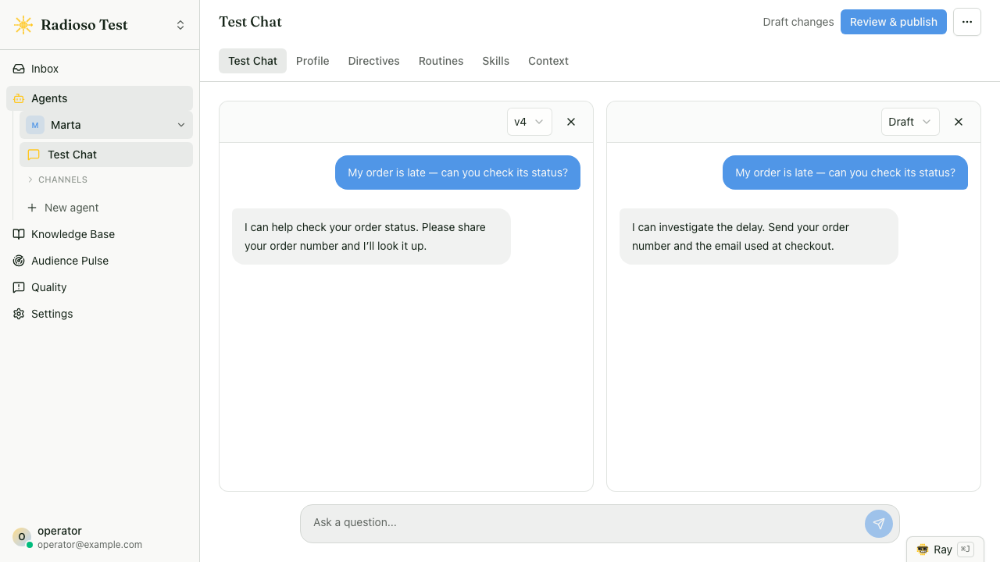

<p align="center">
  <picture>
    <source media="(prefers-color-scheme: dark)" srcset="./frontend/public/radioso-lockup-dark.svg">
    
  </picture>
</p>

<p align="center">
  <a href="https://docs.radioso.ai">Docs</a> · <a href="https://docs.radioso.ai/why-radioso">Why Radioso?</a> · <a href="https://docs.radioso.ai/quickstarts/run-locally">Run locally</a> · <a href="https://docs.radioso.ai/api-reference">API reference</a> · <a href="./CONTRIBUTING.md">Contributing</a>
</p>

<p align="center">
  <a href="./LICENSE"></a>
  <a href="http://makeapullrequest.com"></a>
  <a href="https://github.com/radioso-ai/radioso/commits/main"></a>
</p>

## Radioso is the self-hosted platform for conversational agents that answer, act, and hand off

Run one script and you have an agent your customers can talk to. It answers from the documents you gave it, with citations so you can check its work. It carries a request across turns: collects what it needs, calls your tools, finishes the job. And when the conversation needs a human, it hands the whole thing to one instead of improvising. All of this happens inside rules you author — we call it [guided autonomy](https://docs.radioso.ai/why-radioso/guided-autonomy). You don't have to enumerate every path in advance, and you don't have to accept whatever the model decides on its own.

Self-hosted, so your data stays put. Multi-provider, so no model lock-in. API-first, because you'll want to build on it.

<p align="center">
  
</p>

The whole thing ships in this repo:

- **[Grounded answers](https://docs.radioso.ai/why-radioso/grounded-answers)** — replies built on your own documents, cited back to them, with retrieval you can tune per agent.
- **[Directives](https://docs.radioso.ai/guides/authoring-directives)** — standing rules matched by meaning, in any language: *"when the customer sounds anxious, slow down and confirm before acting."* Write the rule once; it applies on every turn, on every surface.
- **[Routines](https://docs.radioso.ai/guides/authoring-routines)** — multi-turn flows you author in plain language and publish without a redeploy; the engine runs and resumes them turn to turn until the task is done.
- **[Skills](https://docs.radioso.ai/api/agents-and-skills)** — what the agent can do: grounded retrieval, [your webhooks](./docs/webhook-skills.md), [Slack posts](./docs/slack-skills.md), [customer email](./docs/customer-email-skills.md), or [tools from your own MCP servers](./docs/external-skills.md).
- **[Human takeover](https://docs.radioso.ai/operators/human-takeover)** — an operator claims the conversation and replies as a named person; the Inbox queues waiting handoffs and routine approvals.
- **[Ray, the operator copilot](https://docs.radioso.ai/operators/copilot)** — ask why a conversation went the way it did; when the answer is a change, Ray drafts it as a proposal you review and apply.
- **[Quality & Evals](https://docs.radioso.ai/guides/evals)** — triage weak answers, preserve one as a repeatable eval case in a single request, and verify the fix. [Close the loop.](./docs/quality-eval-learning-loop.md)
- **[Audience Pulse](./docs/architecture/topic-census.md)** — a census of the last 30 days of visitor questions: named topics with exact counts, recurring grounding gaps, and content recommendations you can open as a draft document.
- **[Workbench](https://docs.radioso.ai/guides/workbench)** — replay real conversations against your draft changes before they go live.
- **[Website embed](https://docs.radioso.ai/quickstarts/website-embed)** — one script tag opens a themed chat widget on origins you approve.
- **[REST API](https://docs.radioso.ai/api-reference), [TypeScript SDK](https://docs.radioso.ai/sdk/typescript-getting-started), and [MCP](https://docs.radioso.ai/guides/mcp-server)** — the same agent from your backend, your code, or clients like Cursor and Claude.
- **[Bring your own models](https://docs.radioso.ai/api/settings)** — OpenAI, Anthropic, Gemini, or any OpenAI-compatible endpoint; per-workspace keys and per-capability model choice, changed without a restart.

Every surface hands its turn to the same engine, and every turn records which directive steered it, which skill it dispatched, and which routine step it was on. So when the agent does something you didn't expect, you don't guess — you open the trace, see which rule did it, and fix that.

## Quick start

You need Node.js 24+ and Docker Desktop. A provider API key (OpenAI, Gemini, or Anthropic) can wait — enter it when the bootstrap prompts, or add it later in the app under **Settings → Credentials**.

```bash
./run-dev.sh
```

The bootstrap generates secrets and starts the full stack. OpenAI, OpenAI-compatible, and Gemini keys serve both text and embeddings; with a Claude key, the bootstrap asks which supported provider should create document embeddings.

| Surface | URL |
|---|---|
| App | http://localhost:3000 |
| API | http://localhost:8080 |
| Embed test harness | http://127.0.0.1:4321 |

Then, five minutes and three steps:

1. **Register.** The first registration on an empty server creates the organization and default workspace; the development stack verifies the account and signs you in.
2. **Answer.** Upload a document and ask about it. The reply comes back cited to the document it came from.
3. **Act and hand off.** On the agent's Skills tab, add a Notify Human skill named `contact_human` with a recipient email, then ask to speak to a person. The built-in contact routine takes over: it collects an email and a message, sends them to that recipient, and confirms. That flow is itself just routine data — [authoring routines](https://docs.radioso.ai/guides/authoring-routines) shows how to build your own.

That's the whole product in miniature. Everything else is tuning.

Development-stack notes: source is bind-mounted into the containers, backend TypeScript restarts on change, and prompt templates under `backend/prompts/` are re-read per request. The Compose project is named `radioso` and keeps Postgres on `127.0.0.1:5432` — reachable from your machine, not from public interfaces. To run several stacks side by side, set a distinct `COMPOSE_PROJECT_NAME` together with `RADIOSO_FRONTEND_PORT`, `RADIOSO_BACKEND_PORT`, and `RADIOSO_POSTGRES_PORT` before `./run-dev.sh`; Conductor workspaces pick up their `CONDUCTOR_PORT` allocation automatically.

Production concerns — registration email verification, mail configuration, secrets — live in [Deployment](https://docs.radioso.ai/operators/deployment) and [Authentication](https://docs.radioso.ai/guides/authentication).

For Enterprise Edition development, `./run-ee-dev.sh` starts Postgres in Docker and runs the backend, workers, frontend, and embed harness on the host with the commercial packages from `ee/packages` built in. Plain `./run-dev.sh` removes the generated Enterprise routes before starting the OSS stack.

## How a turn works

Every human-facing turn takes one path: the conversation engine, a loop with four phases.

1. **Gather** — interpret the message: intent, query rewrite, routing.
2. **Select** — decide which skill or skills the turn needs.
3. **Dispatch** — run them through one invocation port.
4. **Compose** — build the reply from what they returned and the steering that applies.

The loop holds the mechanism; the behavior lives in small units you register.

- A **skill** is something the agent *does* — grounded retrieval, a lookup, a webhook call. It is dispatched through one port and returns a result. Retrieval itself is the `retrieval.answer` skill, reached the same way as every other capability.
- A **directive** is a standing rule that shapes *how* the agent behaves: a condition paired with an action, judged by the model by meaning — Radioso is multilingual, so a condition is never a keyword list — and added to the turn's instructions when it holds.
- A **routine** is a stateful, multi-turn flow authored as data — in the dashboard or over the API — then validated and published with no redeploy. The platform compiles it into a graph the engine runs and resumes turn to turn.

**Skills act, directives steer, routines carry a flow across turns.**

```
    Web app · REST API · TS SDK · MCP server · Website embed
      (browser, your code, Node app, Cursor/Claude/ChatGPT)
                               │ a turn enters the engine
                               ▼
   ═══════════════════ Conversation engine ═════════════════════

      Gather ──▶ Select ──▶ Dispatch ──▶ Compose ──▶ reply
                   ▲           │
                   │           ▼
      ┌───────────────┐   ┌─────────────────┐
      │ Directives    │   │     Skills      │
      │ matched rules │   │ retrieval.answer│
      │ that steer    │   │ documents.search│
      │ selection &   │   │ assistant.chat  │
      │ the reply     │   │ your skill …    │
      └───────▲───────┘   └─────────────────┘
              │
      ┌───────┴───────┐
      │ Routines      │  an active flow projects a
      │ stateful      │  directive each turn, and can
      │ multi-turn    │  drive a skill, take an action,
      │ flows         │  or hand off to a person
      └───────────────┘

   ═════════════════════════════════════════════════════════════
                               │ retrieval.answer reads
                               ▼
   Your content ──▶ ┌──────────────────────────────────┐
   chunk + embed    │       Postgres + pgvector        │
                    │   documents · chunks · vectors   │
                    └──────────────────────────────────┘
```

Adding a capability or a rule means registering a unit, not editing the loop, and the engine is the only turn path the assistant uses. On eligible turns the engine fuses its pre-answer classification into one planning call, so a simple turn costs two model calls instead of five, with the staged calls as fallback — see [Assistant turn spine](./docs/architecture/assistant-turn-spine.md).

Postgres is the system of record for everything, not just vectors: documents, chunks, embeddings (`pgvector`), conversations, settings, and audit events. Ingestion runs in a background worker, so uploads never block a turn. The engine itself is product-independent: the turn vocabulary lives in [`packages/conversation-contract/`](./packages/conversation-contract) and the pure runtime loop in [`packages/conversation-engine/`](./packages/conversation-engine), while Radioso's auth, retrieval, settings, persistence, and streaming stay in adapters the engine reaches through ports.

The long versions: [Conversational directives](./docs/architecture/conversational-directives.md) and [Conversational routines](./docs/architecture/conversational-routines.md).

## Talking to your agent

Five ways in: the web app, the REST API, the TypeScript SDK, an MCP client, and the website embed.

**Choose the credential for the job.** Personal tokens carry the issuing user's live workspace membership and expire within 90 days. Service accounts are stable workspace identities for CI and unattended workloads; create them under **Settings → API access**, and give each credential an expiry of at most 365 days. Their credentials authorize eligible role-aware workspace APIs.

Agent chat uses a separate credential created on that agent's **Channels → API** or **Channels → MCP** card. It has no `member` or `admin` role: it is bound to one agent and one audience, expires at the time you choose, and is shown once. Workspace payloads carry both `id` and `publicRouteKey`: use `id` in API calls and `publicRouteKey` in dashboard URLs (`/w/<key>/...`). Full account and session flows: [Authentication](https://docs.radioso.ai/guides/authentication).

**Ask a question.** Put the chosen agent's id in the path and use a REST-audience agent credential. Each turn runs through the engine above: it selects `retrieval.answer` when evidence is needed, applies whatever directives match, and resumes an active routine if there is one.

```bash
curl -sS \
  -H "Authorization: Bearer <agent-rest-credential>" \
  -H 'Content-Type: application/json' \
  -d '{"message":"What does the FAQ say about refunds?","stream":false}' \
  http://localhost:8080/api/v1/agents/<agent-id>/chat
```

**Grounded retrieval without the persona.** When you want search or answer generation over workspace content with no assistant behavior, call retrieval directly:

```bash
curl -sS \
  -H "Authorization: Bearer <api-credential>" \
  -H 'Content-Type: application/json' \
  -d '{"query":"refund policy"}' \
  http://localhost:8080/api/v1/retrieval/search

curl -sS \
  -H "Authorization: Bearer <api-credential>" \
  -H 'Content-Type: application/json' \
  -d '{"query":"What does the FAQ say about refunds?"}' \
  http://localhost:8080/api/v1/retrieval/answer
```

`/api/v1/retrieval/search` returns matches instead of an answer. Both accept per-call filters such as `metadataFilter`, and both accept `agentId` to run with one agent's retrieval settings and source scope — the response reports which agent it measured in `agentScope`. See [Documents and search](https://docs.radioso.ai/api/documents-and-search).

```bash
curl -sS \
  -H "Authorization: Bearer <api-credential>" \
  http://localhost:8080/api/v1/skills
```

**See why.** Responses are lean by default. Add `includeDebug: true` and diagnostics arrive under a `debug` field — routing, retrieval summaries, activity traces, and full evidence — instead of mixing into the user-facing payload.

**Everything else.** Agents and their per-skill settings live under `/api/v1/agents`; routines are authored per agent under `/api/v1/agents/<agentId>/routines` (draft, validate, publish). `GET /api/v1/skills` lists the skills the engine can select. History, settings, the document-type catalog, answer feedback, quality triage, and usage subtotals each have their own routes — start at the [API index](https://docs.radioso.ai/api) or the [OpenAPI reference](https://docs.radioso.ai/api-reference).

### TypeScript SDK

The SDK wraps role-aware workspace chat, streaming, and document management, and follows the same lean-response contract (`response.debug` when you asked for it):

```ts
import { createRadiosoClient } from "@radioso/typescript-sdk";

const client = createRadiosoClient({
  baseUrl: "http://localhost:8080",
  apiToken: process.env.RADIOSO_API_TOKEN!,
});

await client.documents.create({
  title: "Support FAQ",
  content: "...",
  source: { kind: "website", url: "https://example.com/docs" },
});

for await (const event of client.chat.stream({ message: "Summarize the FAQ" })) {
  if (event.type === "chunk") process.stdout.write(event.text);
}
```

That client uses the personal or service-account credential supplied as `apiToken`. A client that should only converse with one agent uses a separate REST-audience agent credential with `POST /api/v1/agents/{agentId}/chat`.

Start with [Getting started](https://docs.radioso.ai/sdk/typescript-getting-started) and [Basic usage](https://docs.radioso.ai/sdk/basic-usage).

### MCP

Radioso's supported MCP surface is the standalone HTTP server. It exposes `ask_agent`, which talks to exactly one agent through its full turn loop. A signed-in user with permission to manage that agent creates an MCP-audience credential from **Channels → MCP**; the dashboard uses `POST /api/v1/agents/{agentId}/channel-credentials`. Send the one-time secret to standalone `/mcp`, where the server exchanges it for a short-lived session. Personal and service API credentials are workspace credentials and are not MCP credentials. Operator-minted MCP credentials use a static bearer, so Radioso does not require an OAuth flow.

The package has no stdio MCP entrypoint. Run the standalone HTTP server and give it the original MCP-audience agent credential. Hosted clients such as Claude Desktop and ChatGPT require a public HTTPS deployment; local clients can use the standalone HTTP URL.

### Website embed

One script tag, pasted on any page of an approved origin, opens a Radioso-hosted chat iframe — no backend work on the host site, and origin policy stays under your control. The widget, theming, and origin approval are part of the open-source build; Enterprise Edition adds human-contact routing on top. The **Web chat** page under an agent's Channels section holds both placements — public link and website widget — with each public-launch credential's status and last use; rotation stops new sessions on the old value immediately. Public-launch credentials are separate from personal and service API credentials. See the [website embed quickstart](https://docs.radioso.ai/quickstarts/website-embed).

## Configuration and operations

Short version here; every link goes to the full reference.

- **Models and keys.** Workspaces store their own provider keys (encrypted with `CONNECTOR_ENCRYPTION_KEY`) and pick a model per capability — chat, rewrite, rerank — with no restart. Resolution at chat time is agent override → workspace preference → environment default. [Settings API →](https://docs.radioso.ai/api/settings)
- **Ingestion.** Uploads create durable Postgres jobs first; chunking, parsing, and embedding run in a background worker. Optional metadata extraction classifies each document against a workspace-defined type catalog and writes typed tags that per-agent retrieval rules can filter and boost on. [Document metadata →](https://docs.radioso.ai/guides/document-metadata) · [Document processing →](https://docs.radioso.ai/operators/document-processing)
- **Website crawler.** `POST /api/v1/document/crawl` crawls a site with the bundled provider and publishes pages through the normal ingestion pipeline. It identifies as `RadiosoCrawler/1.0` and records `401`/`403`/`429` responses as failed pages rather than ingesting them. [Website crawler →](./docs/website-crawler.md)
- **Deployment.** Backend, frontend, and workers are separate services; the backend migrates the database on startup. Worker dispatch polls by default, with Cloud Tasks and AMQP drivers for push; rate limits and reverse-proxy hops are environment-tuned. [Deployment →](https://docs.radioso.ai/operators/deployment) · [Self-hosting operations →](https://docs.radioso.ai/operators/self-hosting-operations)
- **Observability.** Runtime flags, `/metrics`, and optional PostHog or Sentry sinks. [Observability →](./docs/oss-saas-observability.md)
- **Authenticated LLM request limits.** Assistant chat and retrieval answer/search share a durable operator-configured limit. Browser sessions are scoped by account and workspace; personal and service credentials receive separate credential-specific buckets. [Deployment →](https://docs.radioso.ai/operators/deployment)

## Docs

The full documentation lives at [docs.radioso.ai](https://docs.radioso.ai): [quickstarts](https://docs.radioso.ai/quickstarts/run-locally), [core concepts](https://docs.radioso.ai/concepts), the [API reference](https://docs.radioso.ai/api-reference), and [operator runbooks](https://docs.radioso.ai/operators/deployment). Architecture deep-dives are in-repo under [`docs/architecture/`](./docs/architecture), starting with the [assistant turn spine](./docs/architecture/assistant-turn-spine.md); [docs/README.md](./docs/README.md) indexes the rest.

## Contributing

Contributions are welcome. Run `./run-dev.sh` for a full local stack, then read [CONTRIBUTING.md](./CONTRIBUTING.md) for per-package test targets, the `pnpm run ci:local` check to run before opening a pull request, and the Conventional Commits format the history uses.

```
backend/         Express API and background document worker
frontend/        Next.js application
typescript-sdk/  First-party TypeScript SDK
packages/        Shared local packages (conversation engine, MCP server, parser, contracts)
infra/           Docker Compose and Terraform
docs/            Product and SDK guides
```

Found a security vulnerability? Report it privately — see [SECURITY.md](./SECURITY.md). By taking part you agree to the [Code of Conduct](./CODE_OF_CONDUCT.md).

## License

Radioso is dual-licensed:

- The open-source edition is licensed under the [Apache License, Version 2.0](./LICENSE).
- The files under [`ee/`](./ee) are Radioso Enterprise Edition, commercial source-available software governed by [`ee/LICENSE`](./ee/LICENSE), and are **not** covered by Apache 2.0. We are happy for everyone to run Radioso for business and personal purposes; `ee/` holds the features and setups we need to run Radioso as a cloud service, and using them requires a commercial license. Contact us for inquiries!

See [NOTICE](./NOTICE) for attribution and the Enterprise Edition.
